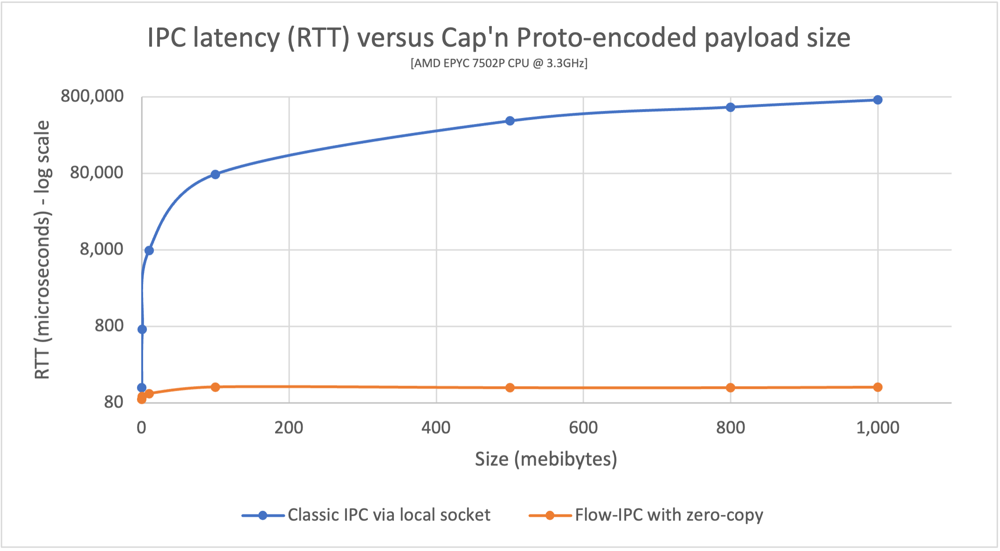

# Flow-IPC: Modern C++ toolkit for fast inter-process communication (IPC)

In this context, IPC means the sharing or transmission of a *data structure* from *one process to another*.
In C++ systems programing, this is a common activity with significant impact on system performance.  E.g.,
it is used heavily in microservices.

In serious C++ applications, high-performance IPC code tends to be difficult to develop and reuse,
and the most obvious and effective technique to combat latency -- avoiding copying -- further increases the difficulty
and decreases reusability by an order of magnitude.

This project -- *Flow-IPC* -- enables C++ code for IPC that is both performant and easy to develop/reuse, with
no trade-off between the two.

Flow-IPC is for *C++17* (or higher) programs built for *Linux* that run on x86-64 processors.
(Support for macOS/BSD and ARM64 is planned as an incremental task.  Adding networked IPC is also a natural
next step.)

## Documentation

The [guided Manual](https://flow-ipc.github.io/doc/flow-ipc/versions/main/generated/html_public/about.html)
explains how to use Flow-IPC.  A comprehensive [Reference](https://flow-ipc.github.io/doc/flow-ipc/versions/main/generated/html_public/namespaceipc.html)
is inter-linked with that Manual.

The [project web site](https://flow-ipc.github.io) contains links to documentation for each individual release as well.

Please see below, in this README, for a [Primer](#flow-ipc-primer) as to the specifics of Flow-IPC.

## Obtaining the source code

- As a tarball/zip: The [project web site](https://flow-ipc.github.io) links to individual releases with notes, docs,
  download links.
- For Git access: `git clone --recurse-submodules git@github.com:Flow-IPC/ipc.git`

## Installation

See [INSTALL](./INSTALL.md) guide.

## Contributing

See [CONTRIBUTING](./CONTRIBUTING.md) guide.

---

# Flow-IPC Primer

## Background

We focus on IPC of data structures (and native sockets a/k/a FDs).  That is: Process P1 has a data structure X,
and it wants process P2 to access it (or a copy thereof) ASAP.

The OS and third-parties avail C++ developers of many tools for/around IPC.  Highlights:
  - Pipes, Unix domain sockets, message queues (MQs), and more such *IPC transports* allow transmitting data
    (binary blobs and sometimes FDs).  Data are copied into the kernel by P1, then out of the kernel by P2.
  - P1 can put X into *shared memory* (SHM) and signal P2 to access it directly there,
    eliminating both X copies.
  - *In-place schema-based serialization tools*, the best of which is
    [Cap'n Proto](https://capnproto.org/language.html), hugely help in representing *structured data* within
    binary blobs.

IPC is not so different from triggering a function call with argument X in a different thread -- just
across process boundaries.  Unfortunately, in comparison to that:
  - The resulting machine code is *much slower*.
  - The source code to achieve it is *much more difficult to develop and reuse*.
    - If one avoids copying X -- the basic cause of the slowness -- the difficulty/lack of reusability spikes
      further.

## How does Flow-IPC help?

*Flow-IPC* makes IPC code:
  - *easy* to write in reusable fashion -- transmitting **Cap'n Proto**-encoded structured data, **STL-compliant
    native C++ data structures**, binary blobs, and **native handles (FDs)**;
  - *highly performant* by seamlessly eliminating *all* copying of the transmitted data.
     This is called *end-to-end zero-copy*.
    - If you transmit [Cap'n Proto schema](https://capnproto.org/language.html)-based messages, you get end-to-end
      zero-copy performance with Flow-IPC.
    - If you share native C++ data structures, including arbitrarily nested STL-compliant containers and pointers,
      you also get end-to-end zero-copy performance with Flow-IPC.  We provide access to shared memory for this purpose
      and manage SHM arenas automatically, so you need not worry about cleanup, naming, or allocation details.
      - In particular we integrate with [jemalloc](https://jemalloc.net), a commercial-grade thread-caching memory
        manager at the core of FreeBSD, Meta, and others.

The graph above is an example of the performance gains you can expect when using Flow-IPC zero-copy transmission, from
the included `perf_demo` tool.  (Here we use Cap'n Proto-described data.  Native C++ structures have a similar
performance profile.)

In this example, app 1 is a memory-caching server that has pre-loaded into RAM a few
files ranging in size from 100kb to 1Gb.  App 2 (client) requests a file of some size.  App 1 (server) responds
with a single message containing the file's data structured as a list of chunks, each accompanied by that chunk's hash:

  ~~~{.capnp}
  # ...
  struct GetCacheReq { fileName @0 :Text; }
  struct GetCacheRsp
  {
    # We simulate the server returning files in multiple equally-sized chunks, each sized at its discretion.
    struct FilePart
    {
      data @0 :Data;
      dataSizeToVerify @1 :UInt64; # Recipient can verify that `data` blob's size is indeed this.
      dataHashToVerify @2 :Hash; # Recipient can hash `data` and verify it is indeed this.
    }
    fileParts @0 :List(FilePart);
  }
  # ...
  ~~~

App 2 receives the `GetCacheRsp` message and prints the round-trip time (RTT): from just before sending
`GetCacheReq` to just after accessing some of the file data (e.g. `rsp.getFileParts()[0].getHashToVerify()` to check
the first hash).  This RTT is the *IPC-induced latency*: roughly speaking the time (mostly as processor cycles)
penalty compared to having a monolithic application.

In the graph, we compare the RTTs (latencies) of two techniques:
  - The *blue line* shows the latency (RTT) when using "classic" IPC over a Unix-domain stream socket.  The server
    `::write()`s the capnp-generated serialization, in order, into the socket FD; the client `::read()`s it out of
    there.
  - The *orange line* shows the RTT when using Flow-IPC with zero-copy enabled.

Observations (tested using server-grade hardware):
  - With Flow-IPC: the round-trip latency is ~100 microseconds *regardless of the size of the payload*.
  - Without Flow-IPC: the latency is about 1 *milli*second for a 1-megabyte payload and approaching a *full second*
    for a 1-gigabyte file.
    - Also significantly more RAM might be used at points.
  - For very small messages the two techniques perform similarly: ~100 microseconds.

The code for this, when using Flow-IPC, is straighforward.  Here's how it might look on the client side:

  ~~~
  // Specify that we *do* want zero-copy behavior, by merely choosing your backing session type.
  using Session = ipc::session::shm::classic::Client_session;

  // Open session e.g. near start of program.  A session is the communication context between the processes
  // engaging in IPC.  (You can create communication channels at will from the `session` object.  No more naming!)

  // CLI_APP + SRV_APP are simple structs naming the 2 apps ("us" and "them"), so we know with whom to engage in IPC
  // and vice versa.
  Session session{ CLI_APP, SRV_APP, ... };
  // Ask for 1 communication *channel* to be immediately available.
  Session::Channels ipc_channels(1);
  session.sync_connect(session.mdt_builder(), &ipc_channels); // Instant.
  auto& ipc_channel = ipc_channels[0];
  // (Can also non-blockingly open more channel(s) anytime: session.open_channel().)

  // ...

  // Issue request and process response.  TIMING STARTS HERE -->
  auto req_msg = ipc_channel.create_msg();
  req_msg.body_root()->initGetCacheReq().setFileName("huge-file.bin"); // Vanilla Cap'n Proto-using code.
  const auto rsp
    = ipc_channel.sync_request(req_msg) // Send message; get ~instant reply.
        ->body_root().getGetCacheRsp(); // Back to vanilla capnp work.
  // <-- TIMING STOPS HERE.
  // ...
  verify_hash(rsp, some_file_chunk_idx);

  // ...

  void verify_hash(perf_demo::schema::GetCacheRsp::Reader rsp, size_t idx)
  {
    const auto file_part = rsp.getFileParts()[idx];
    if (file_part.getHashToVerify() != compute_hash(file_part.getData()))
    {
      throw Bad_hash_exception(...);
    }
  }
  ~~~

In comparison, without Flow-IPC: To achieve the same thing, with
end-to-end zero-copy performance, a large amount of difficult code would be required, including management of
SHM segments whose names and cleanup have to be coordinated between the 2 applications.  Even *without*
zero-copy -- i.e., simply `::write()`ing a copy of the capnp serialization of `req_msg` to and `::read()`ing
`rsp` from a Unix domain socket FD -- sufficiently robust code would be significant in length and complexity;
and challenging to make reusable.

## Quick tour

Flow-IPC is comprehensive, aiming to be useful in black-box fashion but providing public APIs and customization
at lower layers also.  The guided Manual (linked above) covers everything...

...but here are a few specific topics of potential high interest, *in case* you're looking to jump into some
code right away.

  - Perhaps the median topic of interest is transmission of structured-data messages, as described
    by a [schema language](https://capnproto.org/language.html), namely Cap'n Proto a/k/a *capnp*.
    capnp by itself provides best-in-class *serialization*.  However: If you'd like to *transmit* your
    serialized capnp-encoded message between processes, you're on your own: capnp provides only rudimentary
    capabilities.  With Flow-IPC, however, it becomes easy:
    - See the [synopsis/example](https://flow-ipc.github.io/doc/flow-ipc/versions/main/generated/html_public/api_overview.html#api_overview_transport_struc_synopsis)
      of transmitting structured Cap'n Proto-described messages between processes.
    - Yet that still involves (behind the scenes) having to *copy the content of the data twice*: sender user memory =>
      IPC transport (e.g., Unix domain socket) => receiver user memory.  Messages can be very large including,
      e.g., entire images or videos in a web cache server.
    - Ideally, instead, one wants **end-to-end zero-copy performance** and semantics.  I.e., receiver user memory *is*
      sender user memory: "Sender" simply writes the data; "receiver" (having been informed in some way) simply reads
      those same data, in-place.
      - Normally this requires shared memory (SHM) work which is difficult coding even in specialized scenarios.
      - Flow-IPC, however, makes it very easy...
    - ...as shown in this
      [explanation](https://flow-ipc.github.io/doc/flow-ipc/versions/main/generated/html_public/api_overview.html#api_overview_transport_struc_zero)
      and [code example](https://flow-ipc.github.io/doc/flow-ipc/versions/main/generated/html_public/api_overview.html#api_overview_transport_struc_zero_synopsis).
      Note the *2 changed lines of code* when setting up.
      - The "meat" of the earlier-linked example code remains unchanged; just regular capnp accessor/mutator calls
        familiar to vanilla-Cap'n Proto users.  (Users of Protocol Buffers and similar should also feel right at home.)
  - The above example jumps into the middle of things, after you've connected from one program to another
    (established a *session*) and have at least 1 *channel* opened.  Without Flow-IPC, accomplishing this is no mean
    feat either and tends to be written and rewritten by each project that wants to do IPC, again and again.
    With Flow-IPC, it is easy: see the
    [synopsis about sessions](https://flow-ipc.github.io/doc/flow-ipc/versions/main/generated/html_public/api_overview.html#api_overview_sessions_synopsis).
  - You can also check out a [simple complete example](https://github.com/Flow-IPC/ipc_shm/tree/main/test/basic/link_test),
    namely one of our functional tests, in which one program
    connects to another, establishes a session and channel, then transmits exchanges a capnp-encoded hello-world, with
    end-to-end zero copy.

We guess those are the likely topics of highest interest.  That said, Flow-IPC provides entry points at every layer
of operation, both higher and lower than the above.  Flow-IPC is *not* designed as merely a "black box" of capabilities.
E.g., for advanced users:
  - Various lower-level APIs, such as low-level transports (Unix domain sockets, MQs) and SHM operations can be
    accessed directly.  You can also plug-in your own.
  - By implementing or accessing some of the handful of key concepts, you can customize behaviors at all layers,
    including serialization-memory backing, additional SHM providers, and C-style native data structures that use raw
    pointers.

Flow-IPC is comprehensive and flexible, as well as performance-oriented with an eye to safety.
The [API tour page of the Manual](https://flow-ipc.github.io/doc/flow-ipc/versions/main/generated/html_public/api_overview.html)
will show you around.  The rest of the [guided Manual](https://flow-ipc.github.io/doc/flow-ipc/versions/main/generated/html_public/pages.html)
and the [Reference](https://flow-ipc.github.io/doc/flow-ipc/versions/main/generated/html_public/namespaceipc.html)
go deeper.
