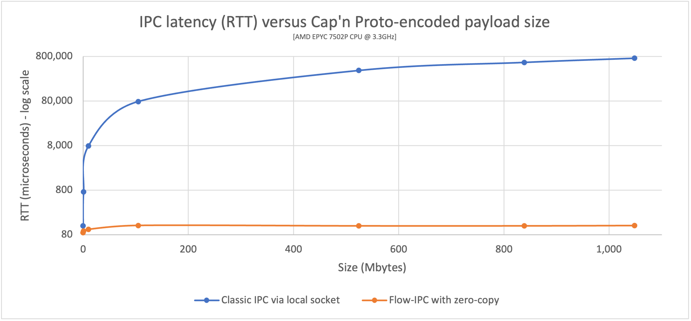

# Flow-IPC: Modern C++ toolkit for fast inter-process communication (IPC)

In this context, IPC means the sharing or transmission of a *data structure* from *one process to another*.
In C++ systems programing, this is a common activity with significant impact on system performance.  E.g.,
it is used heavily in microservices.

In serious C++ applications, high-performance IPC code tends to be difficult to develop and reuse,
and the most obvious and effective technique to combat latency -- avoiding copying -- further increases the difficulty
and decreases reusability by an order of magnitude.

This project -- *Flow-IPC* -- enables C++ code for IPC that is both performant and easy to develop/reuse, with
no trade-off between the two.

Flow-IPC is for *C++17* (or higher) programs built for *Linux* that run on x86-64 processors.
(Support for macOS/BSD and ARM64 is planned as an incremental task.  Adding networked IPC is also a natural
next step.)

## Documentation

The [guided Manual](https://flow-ipc.github.io/doc/flow-ipc/versions/main/generated/html_public/about.html)
explains how to use Flow-IPC.  A comprehensive [Reference](https://flow-ipc.github.io/doc/flow-ipc/versions/main/generated/html_public/namespaceipc.html)
is inter-linked with that Manual.

The [project web site](https://flow-ipc.github.io) contains links to documentation for each individual release as well.

Please see below, in this README, for a [Primer](#flow-ipc-primer) as to the specifics of Flow-IPC.

## Obtaining the source code

- As a tarball/zip: The [project web site](https://flow-ipc.github.io) links to individual releases with notes, docs,
  download links.
- Via Git: `git clone --recurse-submodules git@github.com:Flow-IPC/ipc.git`
  - **Note:** Don't forget `--recurse-submodules`.

## Installation

See [INSTALL](./INSTALL.md) guide.

## Contributing

See [CONTRIBUTING](./CONTRIBUTING.md) guide.

---

# Flow-IPC Primer

## Background

Flow-IPC focuses on IPC of data structures (and native sockets a/k/a FDs).  I.e., the central scenario is:
Process P1 has a data structure *X*, and it wants process P2 to access it (or a copy thereof) ASAP.

The OS and third-parties already avail C++ developers of many tools for/around IPC.  Highlights:
  - Pipes, Unix domain socket streams, message queues (MQs), and more such *IPC transports* allow transmitting data
    (binary blobs and sometimes FDs).  Data are copied into the kernel by P1, then out of the kernel by P2.
  - P1 can put X into *shared memory* (SHM) and signal P2 to access it directly there,
    eliminating both copy-X operations.
  - *Zero-copy schema-based serialization tools*, the best of which is
    [Cap'n Proto](https://capnproto.org/language.html), hugely help in representing *structured data* within
    binary blobs.

Conceptually, the IPC op above is not so different from triggering a function call with argument X in a different
thread -- but across process boundaries.  Unfortunately, in comparison to triggering `F(X)` in another thread
in-process:
  - The resulting machine code is *much slower*, using more processor cycles and memory.
  - The source code to achieve it is *much more difficult to develop and reuse*, even with the help
    of powerful APIs including Boost.interprocess and Boost.asio.
    - If one wishes to avoid copying X -- the basic cause of the slowness -- one must use SHM to store X.  This increases the difficulty
      10-fold, and the resulting code is rarely reusable.

## How does Flow-IPC help?

With Flow-IPC, the above IPC op is easy to code, for any form of "X," whether: blobs, FDs, nested STL-compliant
containers, C-style `struct`s with pointers, or Cap'n Proto schema-based structured data.

Moreover, it eliminates all copying of X -- which results in the best possible performance.
This is called *end-to-end zero-copy*.

## Example: End-to-end zero-copy performance, Cap'n Proto payload

The graph above is an example of the performance gains you can expect when using Flow-IPC zero-copy transmission, from
the included `perf_demo` tool.  (Here we use Cap'n Proto-described data.  Native C++ structures have a similar
performance profile.)  In the graph, we compare the RTTs (latencies) of two techniques, for transmitted payloads
of various sizes.
  - The *blue line* shows the latency (RTT) when using "classic" IPC over a Unix-domain stream socket.  The server
    `::write()`s the capnp-generated serialization, in order, into the socket FD; the client `::read()`s it out of
    there.
  - The *orange line* shows the RTT when using Flow-IPC with zero-copy enabled.

In this example, app 1 is a memory-caching server that has pre-loaded into RAM a few
files ranging in size from 100kb to 1Gb.  App 2 (client) requests a file of some size.  App 1 (server) responds
with a single message containing the file's data structured as a sequence of chunks, each accompanied by that chunk's
hash:

  ~~~{.capnp}
  # Cap'n Proto schema fragment:
  # ...
  struct GetCacheReq { fileName @0 :Text; }
  struct GetCacheRsp
  {
    # We simulate the server returning files in multiple equally-sized chunks, each sized at its discretion.
    struct FilePart
    {
      data @0 :Data;
      dataSizeToVerify @1 :UInt64; # Recipient can verify that `data` blob's size is indeed this.
      dataHashToVerify @2 :Hash; # Recipient can hash `data` and verify it is indeed this.
    }
    fileParts @0 :List(FilePart);
  }
  # ...
  ~~~

App 2 receives the `GetCacheRsp` message and prints the round-trip time (RTT): from just before sending
`GetCacheReq` to just after accessing some of the file data (e.g. `rsp_root.getFileParts()[0].getHashToVerify()` to
check the first hash).  This RTT is the *IPC-induced latency*: roughly speaking the time
penalty compared to having a monolithic (1-process) application (instead of the *split* into app 1 and app 2).

Observations (tested using decent server-grade hardware):
  - With Flow-IPC: the round-trip latency is ~100 microseconds *regardless of the size of the payload*.
  - Without Flow-IPC: the latency is about 1 *milli*second for a 1-megabyte payload and approaching a *full second*
    for a 1-gigabyte file.
    - Also significantly more RAM might be used at points.
  - For very small messages the two techniques perform similarly: ~100 microseconds.

The code for this, when using Flow-IPC, is straighforward.  Here's how it might look on the client side:

  ~~~
  // Specify that we *do* want zero-copy behavior, by merely choosing our backing-session type.
  using Session = ipc::session::shm::classic::Client_session; // Note the `::shm`: means SHM-backed session.

  // IPC app universe: simple structs naming the 2 apps, so we know with whom to engage in IPC,
  // and same for "them" (server).
  ipc::session::Client_app CLI_APP{ "cacheCli", "/usr/bin/cache_client.exec", CLI_UID, GID };
  ipc::session::Server_app SRV_APP{ { "cacheSrv", "/usr/bin/cache_server.exec", SRV_UID, GID },
                                    { CLI_APP.m_name }, "",
                                    ipc::util::Permissions_level::S_GROUP_ACCESS }; // Safety/permissions selector.
  // ...

  // Open session e.g. near start of program.  A session is the communication context between the processes
  // engaging in IPC.  (You can create communication channels at will from the `session` object.  No more naming!)
  Session session{ CLI_APP, SRV_APP, on_session_closed_func };
  // Ask for 1 communication *channel* to be available on both sides from the very start of the session.
  Session::Channels ipc_channels(1);
  session.sync_connect(session.mdt_builder(), &ipc_channels); // Instantly open session -- and the 1 channel.
  auto& ipc_channel = ipc_channels[0];
  // (Can also instantly open more channel(s) anytime: `session.open_channel(&channel)`.)

  // ...

  // Issue request and process response.  TIMING FOR ABOVE GRAPH STARTS HERE -->
  auto req_msg = ipc_channel.create_msg();
  req_msg.body_root()
    ->initGetCacheReq().setFileName("huge-file.bin"); // Vanilla capnp code: call Cap'n Proto-generated-API: mutators.
  const auto rsp_msg = ipc_channel.sync_request(req_msg); // Send message; get ~instant reply.
  const auto rsp_root = rsp_msg->body_root().getGetCacheRsp(); // More vanilla capnp work: accessors.
  // <-- TIMING FOR ABOVE GRAPH STOPS HERE.
  // ...
  verify_hash(rsp_root, some_file_chunk_idx);

  // ...

  // More vanilla Cap'n Proto accessor code.
  void verify_hash(const schema::GetCacheRsp::Reader& rsp_root, size_t idx)
  {
    const auto file_part = rsp_root.getFileParts()[idx];
    if (file_part.getHashToVerify() != compute_hash(file_part.getData()))
    {
      throw Bad_hash_exception(...);
    }
  }
  ~~~

In comparison, without Flow-IPC: To achieve the same thing, with
end-to-end zero-copy performance, a large amount of difficult code would be required, including management of
SHM segments whose names and cleanup have to be coordinated between the 2 applications.  Even *without*
zero-copy -- i.e., simply `::write()`ing a copy of the capnp serialization of `req_msg` to and `::read()`ing
`rsp_msg` from a Unix domain socket FD -- sufficiently robust code would be non-trivial to write in comparison.

The preceding example was chosen for 2 reasons:
  - *Performance*: It demonstrates the performance benefits of end-to-end zero-copy.
  - *capnp integration*: It shows what it's like to transmit capnp-encoded structures using Flow-IPC, plus
    a look at session/channel management and (glancingly) Flow-IPC channel features like request/response.

## So Flow-IPC is for transmitting Cap'n Proto messages?

Yes... but only among other things!
  - It transmits native C++ data structures (including STL-compliant containers and pointers); native handles (FDs);
    and (at a lower layer) binary blobs.  Schema-based data structures are not always an ideal representation for many
    algorithms!
    - *Without Flow-IPC*: Transmitting such objects "by hand" ranges from annoying (blobs) to super-annoying (FDs)
      to really, really difficult (STL-compliant nested structures).
  - It makes opening IPC communication channels (and SHM arenas if desired) easy.  One side of this
    is demonstrated in the above example: Merely name your two apps and open a *session*.
    Now *channels* can be opened/closed at any time, and/or ready at session start (as shown above).
    - *Without Flow-IPC*: You must name ~every socket and MQ and SHM segment, and this name must be known on both sides
      but not conflict; you must arrange a connect-accept setup of some kind; open/create (and later clean-up) SHM
      segments; invoke `mmap()`.  It is a ton of busy-work with many corner cases.
  - For safety/auth, one specifies 1 of 3 presets that will govern permissions settings applied to various OS object
    underneath: *unrestricted*, *shared-user* (all applications have same user ID), or *shared-group* (all applications
    have same group ID but differing user IDs).
    - *Without Flow-IPC*: Sometimes treated as an afterthought, serious server applications need to specify
      permission masks on each individual OS object (SHM segment handle, POSIX MQ handle, stream-socket, etc.).

Flow-IPC provides API entry points at every layer of operation.  Flow-IPC is *not* designed as
merely a "black box" of capabilities.  E.g., for advanced users:
  - Various lower-level APIs, such as low-level transports (Unix domain sockets, MQs) and SHM operations, can be
    accessed directly.  You can also plug-in your own transports.
    - (Networked channels and sessions are in the works.)
  - By implementing/accessing some of the handful of key C++ concepts, you can customize behaviors at all layers,
    including serialization-memory backing, additional SHM providers, and C-style native data structures that use raw
    pointers.

---

## What's next?

If the [example](#how-does-flow-ipc-help) and/or [promises](#so-flow-ipc-is-for-sending-cap-n-proto-messages) above
have piqued your interest:

In the Manual, the [API Overview / Synopsis](https://flow-ipc.github.io/doc/flow-ipc/versions/main/generated/html_public/api_overview.html)
summarizes (with code snippets) what is available in Flow-IPC.

These diagrams from the Manual might also be helpful in showing what's available and/or some of what is going on
underneath.

---

Here's a bird's eye view of Flow-IPC (left) and a compact exploration of a single Flow-IPC channel (right).
(Click/tap to zoom.)

- On the left -- Flow-IPC's mission: applications speaking to each other performantly, in organized fashion.
  The infrastructure inside the dotted-line boxes is provided by Flow-IPC.  Perhaps most centrally this offers
  communication *channels* over which one can transmit *messages* with a few lines of code.
- On the right -- zooming into a single *channel*; and how it transmits data of various kinds, especially without
  copying (therefore at high speed).
  - "capnp" stands for [Cap'n Proto](https://capnproto.org/language.html).
  - This diagram is arguably too "busy."  If so: Please do not worry about the details.  It is a *survey* of what and
    how one *could* transmit via Flow-IPC; different details might appeal to different users.
  - Ultimately, if you've got a message or data structure to share between processes, Flow-IPC will let you do it
    with a few lines of code.

---

The following diagram delves deeper, roughly speaking introducing the *core* layer of `ipc::transport`.

